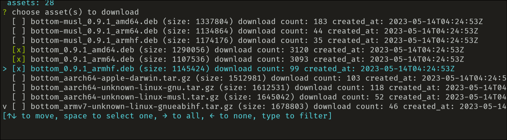
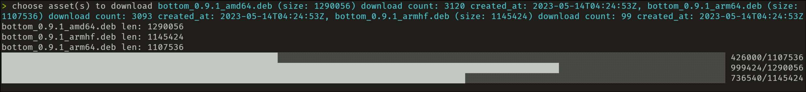

# GitHub Release Downloader

A CLI to browse a GitHub repository's releases and download selected assets in parallel, with progress bars.




## Why?

1. Browser tends to download files into system default download directory, not a current working directory of my terminal.
2. Releases are often too large (more than a Gigabyte) to download by browser. It can be handled by parallel downloaders like Axel.
3. It works without GUI environment.

## Usage

```
github-release-downloader <owner/repo> --token <github-token>
```

- `<owner/repo>`: the repository, e.g. `swc-project/swc`.
- `--token`, `-t`: a GitHub access token.

## Build

```
nix develop
cargo build --release
```

## License

MIT
